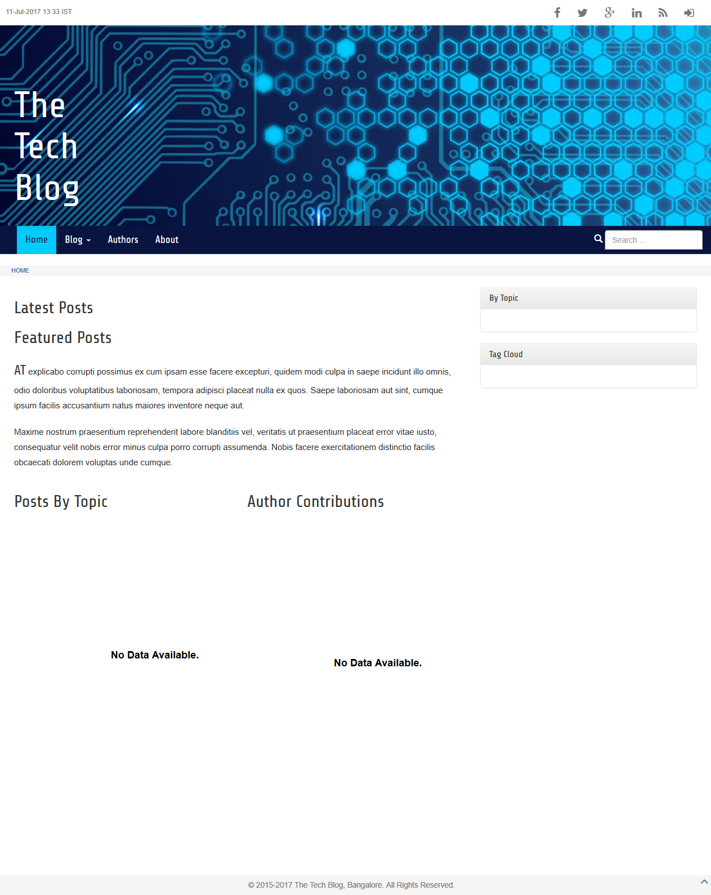
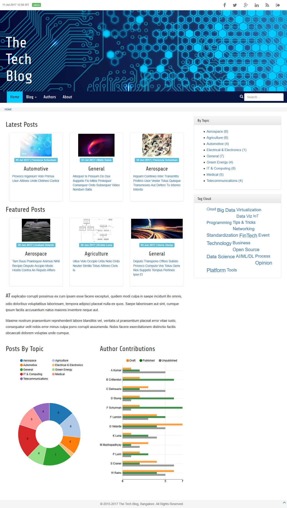

# Introduction #
This is a sample project that can help beginners to learn Django. The example is an implementation of a blogging website. The example illustrates important concepts and programming syntax. Our example website will include page layout, menu, breadcrumbs, header, footer, blog categories, forms, database, and more.

This code is explained in a [tutorial hosted at IEDF website](https://iedf.in/index.php/learn/courses/96-learn-django-by-example). By studying the tutorial, you can learn Django step by step. For each step of the tutorial, use the code given in the tutorial. The code in this repository represents only the last chapter of the tutorial.

# Installation #
Those who wish to skip the tutorial can simply clone or fork this repository. Pre-requisites including Git, Python 3.4.x or newer, pip and virtualenv. To obtain a blank site, these are the steps to follow:
```
# Clone this repo
git clone https://github.com/IndianEngineeringDesignForum/django-basic.git

# Enter the cloned repo
cd django-basic

# Create a virtual environment
virtualenv --python=python3.4 venv

# Activate venv on Linux
source venv/bin/activate

# Activate venv on Windows
.\venv\Scripts\activate

# Install necessary Python packages including Django
pip install -r requirements.txt

# Create the database and perform all migrations
# Database file "thetechblog.sqlite3" will be created
python manage.py migrate

# Start the server
python manage.py runserver
```

The resulting homepage should look like the following:


# Test Data #
You can populate the site with random test data. This will also give you a feel for how the final site will look and what you will learn in the process of reading the code. Note that this will delete any existing data you may have in your database. You can follow these steps:

1. Create some images for posts and user avatars. For convenience, these images have been pre-created and saved in folder `media/` are part of this test data.

2. From root folder, run this command: `python testing/generateTestData.py`. This will generate a file named `testdata.sql`. This contains SQLite commands. Superuser and all other users/authors are given the default password "Django".

3. Get into SQLite command prompt: `sqlite3 thetechblog.sqlite3`

4. Import test data into database: `.read testdata.sql`

Now if you refresh the homepage, you should see something like the following:

# awesome-blog
